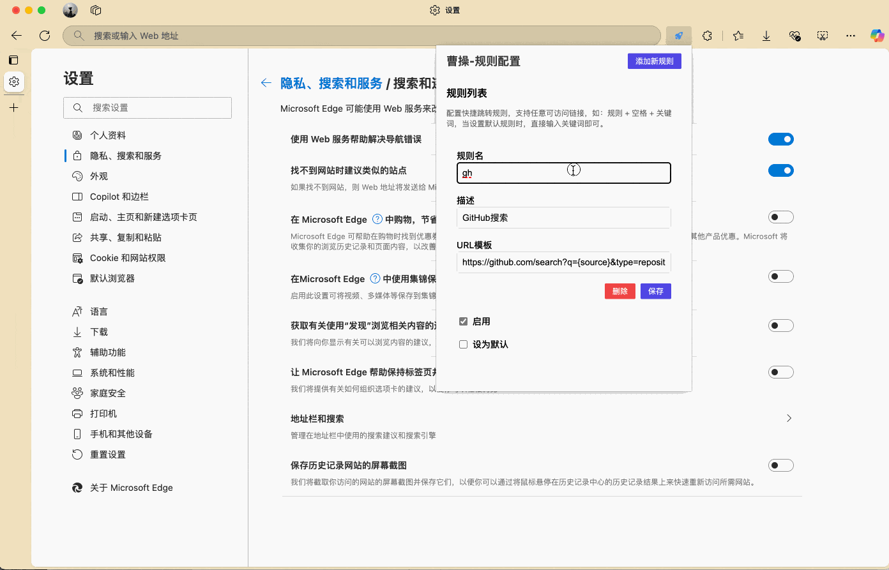

# Chrome 扩展 - 曹操

[中文](README.md) | [English](README_en.md)

这个 Chrome 扩展帮助用户快速直达某些特定有规则的可访问的地址

## 安装

### 源代码

1. 下载代码
2. 打开 Chrome 开发者工具，点击工具栏中的扩展图标
3. 点击"加载已解压的扩展"按钮
4. 选择代码所在的文件夹（`src`）

### CRX 文件

1. [下载 CRX 文件](https://github.com/todrfu/browser-ext-cc/actions/runs/14076500867)
2. 打开 Chrome 开发者工具，点击工具栏中的扩展图标
3. 点击"加载已解压的扩展"按钮
4. 选择 CRX 文件

